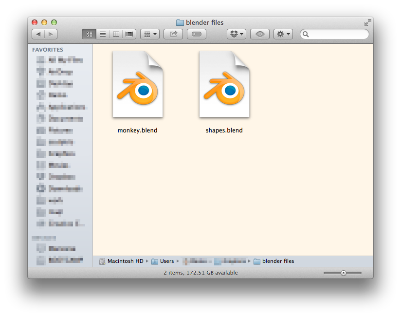
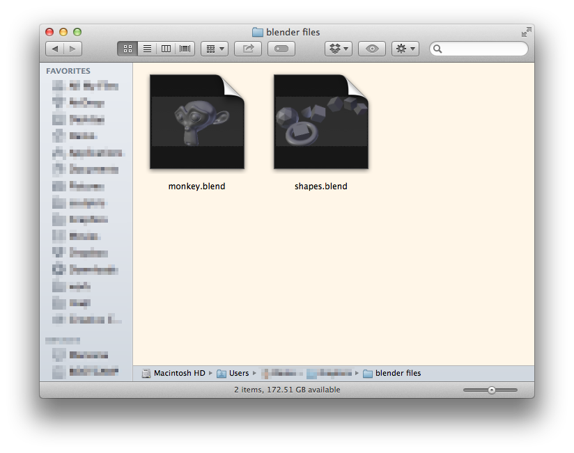

BlenderQuickLook
================

A Quick Look Plugin for generating Blender3D file thumbnails.

Before
---



After
---



Installer
---------

To get the latest built files head to [latest release](https://github.com/vicro/BlenderQuickLook/releases/latest).

Confirmed it works in macOS Sierra 10.12.6

About
---

I made this QuickLook plugin when I noticed the Windows version of Blender3D had thumbnails in the File Explorer but not the Mac version.

It is my first Cocoa/QuickLook application so please point out any errors or bad practices if you can.

In order to read the blender file format, I downloaded the Blender3D version 2.71 source code and read the file `mystery_of_the_blend.html` documentation.

I also looked at the code for generating thumbnails in the Windows File Explorer at this thread:

* [T26044 Windows thumbnails and improved filetype registration](https://developer.blender.org/T26044)
* [thumbhandler_libs.zip](https://developer.blender.org/file/info/PHID-FILE-56coa4rmwic22sbdflwz/)

I got the information on the `TEST` block and the flipped pixels from that code.

Installation
---

1. Build the project in Xcode, then find the compiled `BlenderQuickLook.qlgenerator` in the Products folder in the sidebar, right click on it and select Show in Finder to see the file.
2. Copy the file to ~/Library/QuickLook/
3. Wait until the QuickLook service gets refreshed and the thumbnails should start appearing OR manually refresh it running in the Terminal:

```
qlmanage -r
```

Links
---

I used the following resources to learn how to make the plugin:

* [Creating a Quick Look plugin](http://blog.10to1.be/cocoa/2012/01/27/creating-a-quick-look-plugin/)
* [Quick Look Programming Guide: Introduction to Quick Look Programming Guide](https://developer.apple.com/library/mac/documentation/userexperience/conceptual/quicklook_programming_guide/Introduction/Introduction.html#//apple_ref/doc/uid/TP40005020-CH1-SW1)
* [Declaring UTI types for the QuickLook plugin](http://stackoverflow.com/a/11377830/683558)
